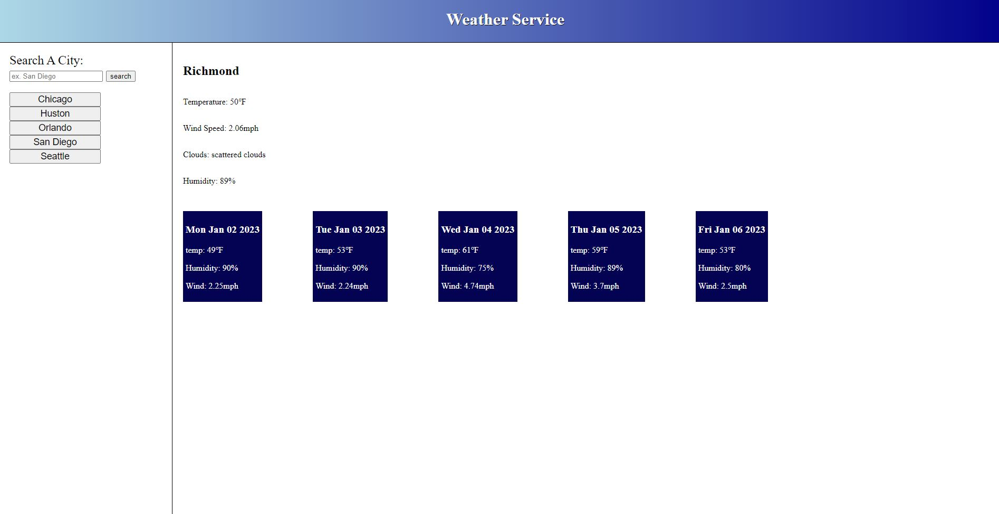

# Weather-service

## Description

Provides user with an easy minimalist way to check the weather for a given destination.

## Table of Contents

- [Installation](#installation)
- [Usage](#usage)
- [Credits](#credits)
- [License](#license)

## Installation

N/A

## Usage

Select a city in the side bar or type one in. Defaults to last viewed held in local storage.

https://bryandalton.github.io/Weather-service/

## Credits

Bryan Dalton
https://github.com/Bryandalton

## License

N/A